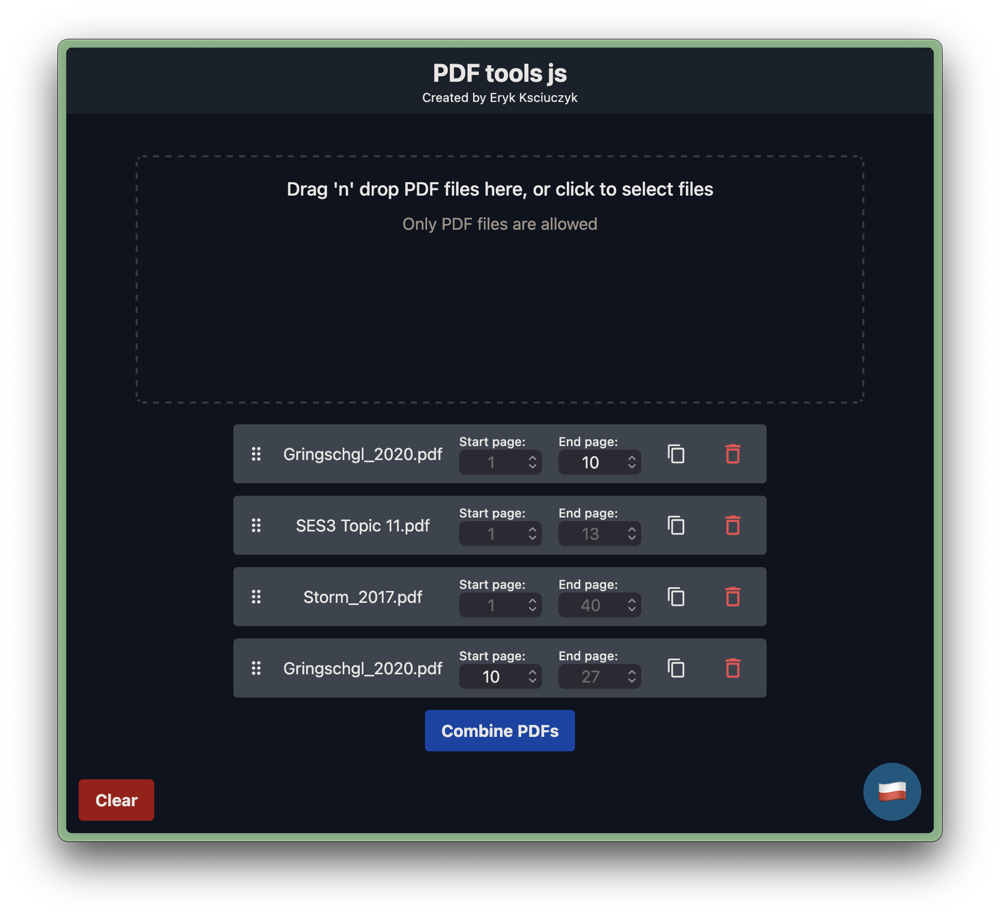

# PDF Tools JS

Tool is available at
[pdf.eryk.one](https://pdf.eryk.one)

PDF Tools JS is a web app built with React and Vite that allows you to merge, cut, and join PDF files.
It uses the [pdf-lib](https://github.com/Hopding/pdf-lib) library to manipulate PDF files in the browser.

**Privacy concern**: This app uses no backend server, it manipulates your files offline.
Your files stay on the device!

**Features:**

- 📎 Merge many PDF files
- ✂️ Split PDF files
- 📄✅ Choose which pages to pick for merge
- 🔒 Privacy respecting (this whole app runs on your machine, the PDFs are not uploaded anywhere)
- 📴 Offline (this app is just a pack of static frontend files)
- ⚡ Lightning fast, as everything happens on your computer, no waiting for uploads and downloads to finish
- 🌍 i18n support, supports both English and Polish language



## How to run using docker

Run this tool on port 8000 using Docker:

```shell
docker run -p 8000:80 ghcr.io/erykksc/pdf-tools-js:latest
```

Go to [http://localhost:8000](http://localhost:8000) in your browser and start cutting, merging, splitting and more on your PDFs!

## How to run from source

To get started with PDF Tools, follow these steps:

1. Clone the repository:

```shell
git clone https://github.com/eroar/pdf-tools-js.git
```

2. Install the dependencies:

```shell
cd pdf-tools-js
npm install
```

3. Start the development server:

```shell
npm run dev
```

This will start the Vite development server and open the app in your default browser.

## License

PDF Tools JS is licensed under [MIT License](./LICENSE.txt)
